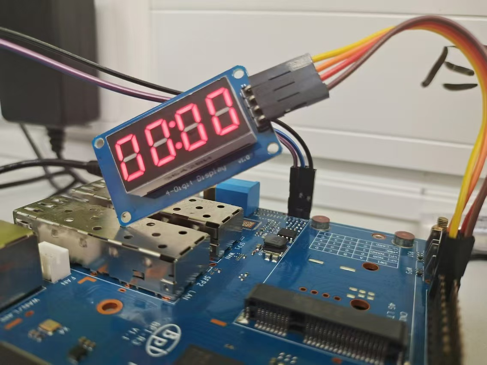
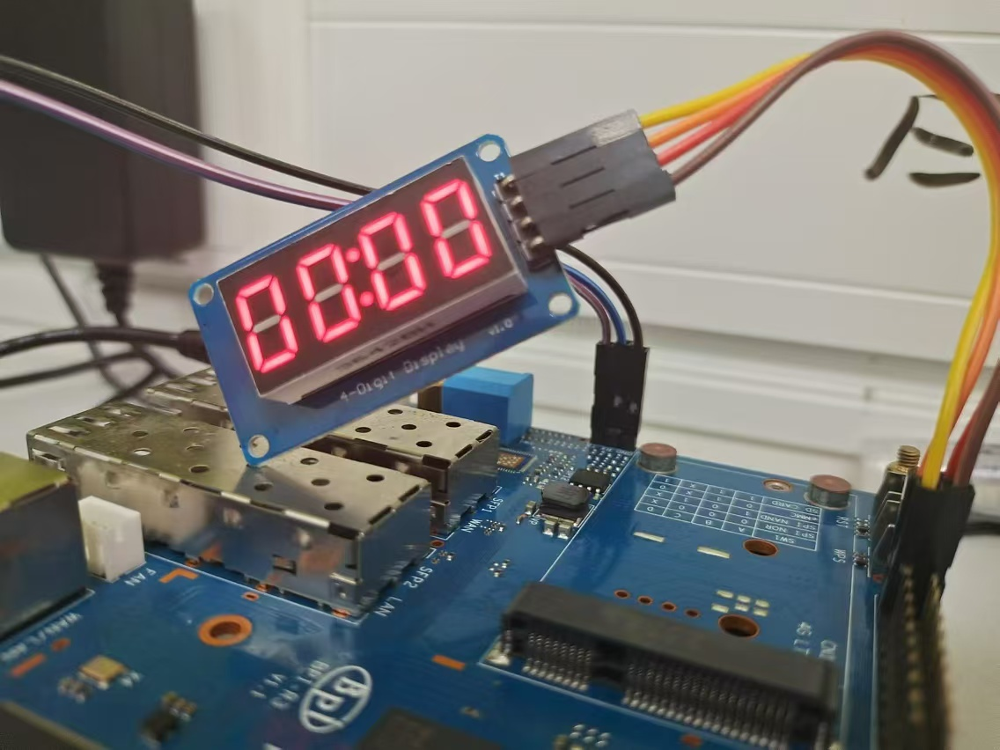
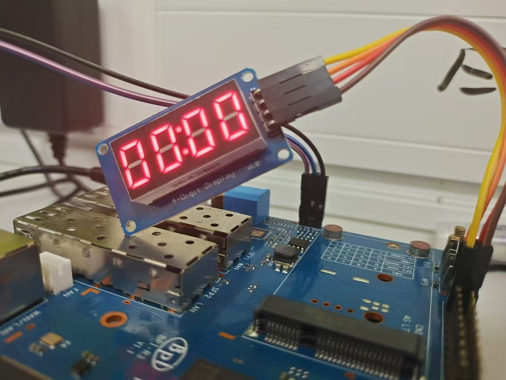
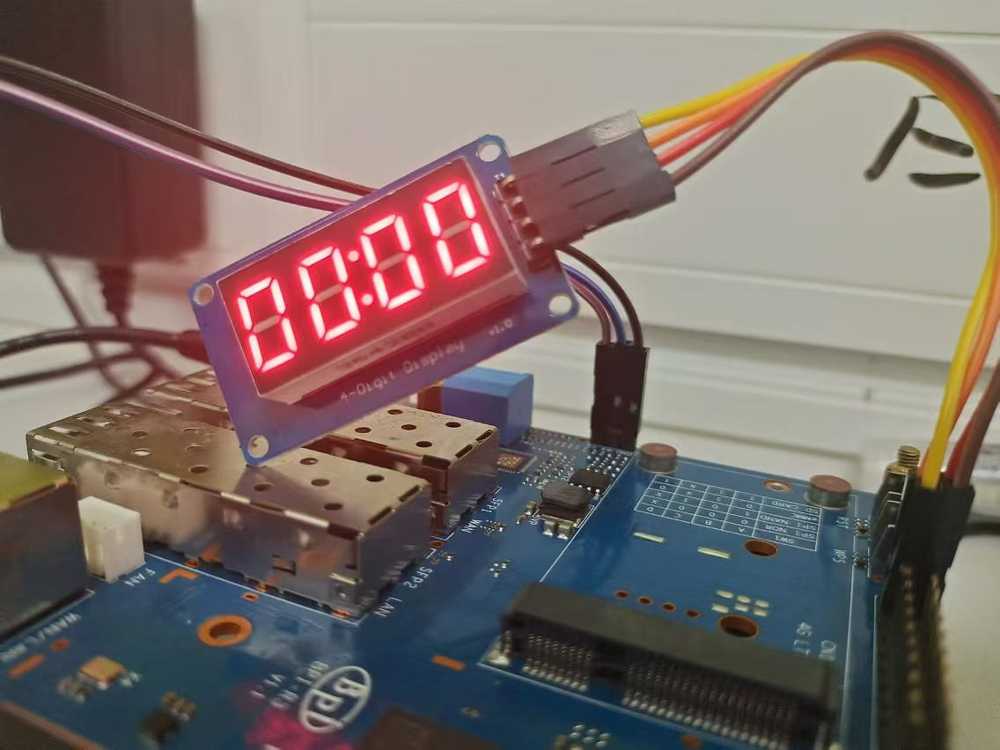
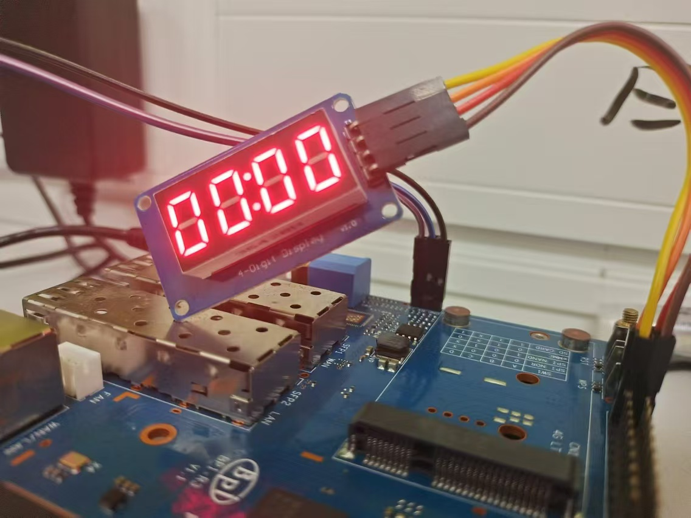
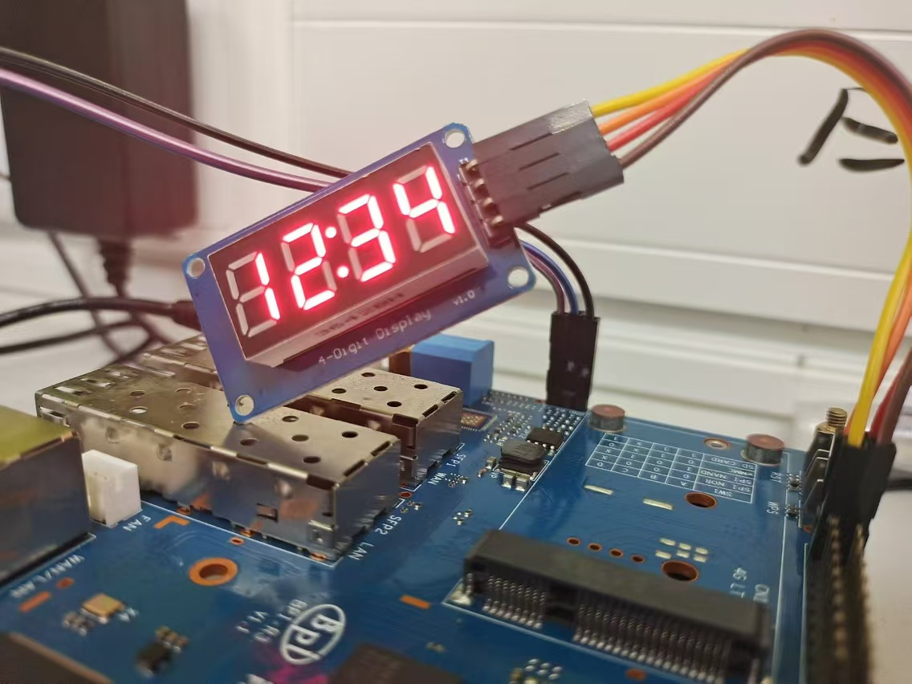
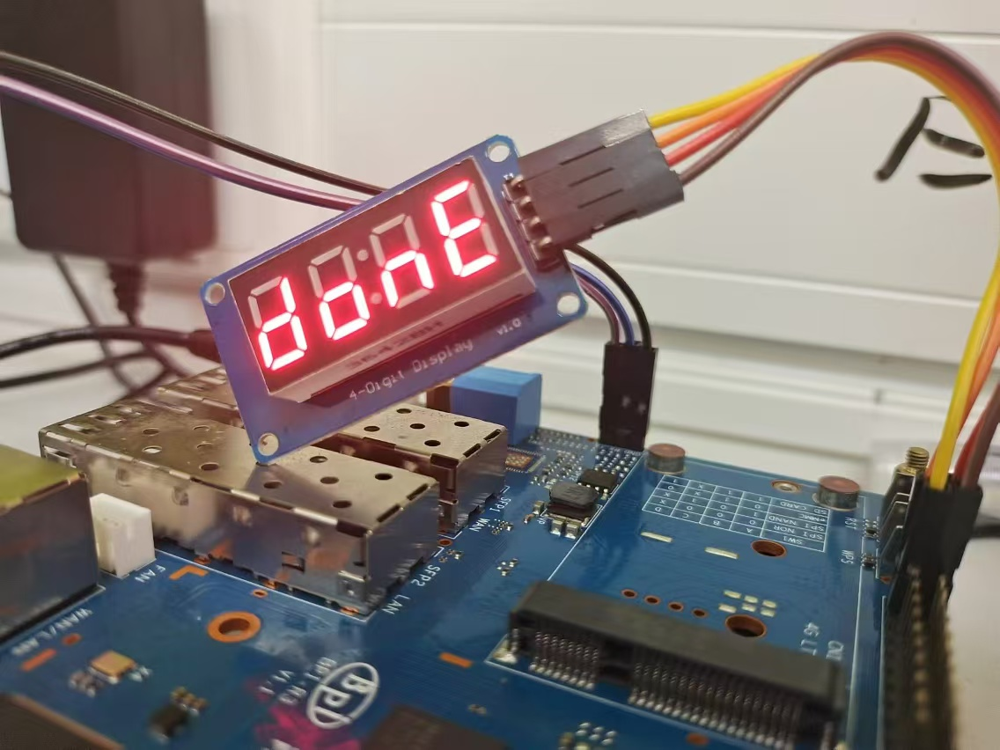

# TM1637 4-Digit 7-Segment Display I2C Driver

This Python module provides a driver for the TM1637 4-Digit 7-Segment Display using I2C communication. It allows easy control of the display, including setting brightness and displaying numbers or custom segments.

## Features

- Initialize and control TM1637 4-Digit 7-Segment Display
- Adjust display brightness (6 levels)
- Display numbers (0-9999)
- Control individual segments for custom displays
- Toggle colon display

## Requirements

- Python 3.x
- `python-periphery` library for I2C communication

## Installation

1. Ensure you have Python 3.x installed on your system.
2. Install the [python-periphery](https://github.com/vsergeev/python-periphery) library:

```
pip install python-periphery

```

3. Copy the `tm1637i2c.py` file into your project.

## Usage

### Initialization

```python
from tm1637i2c import TM1637I2C

# Initialize the display
display = TM1637I2C("/dev/i2c-1")  # Replace with your I2C device path
```

### Adjusting Brightness

```python
# Set brightness (levels 1-6)
display.brightness(TM1637I2C.BRIGHTNESS_LEVEL_1)
```

<div>





</div>


### Displaying Numbers

```python
# Display a number (0-9999)
display.show(1234)
```


```python
# Display a number with colon
display.show(1234, colon=True)
```




### Custom Segment Display

```python


    '''
      
     --a--
    |     |
    f     b
    |     |
     --g--  
    |     |
    e     c
    |     |
     --d--   (dp)
      
    '''
 
# Control individual segments
dev.display(
    TM1637I2C.SEGMENT_B|TM1637I2C.SEGMENT_C|TM1637I2C.SEGMENT_D|TM1637I2C.SEGMENT_E|TM1637I2C.SEGMENT_G, # d
    TM1637I2C.SEGMENT_E|TM1637I2C.SEGMENT_D|TM1637I2C.SEGMENT_C|TM1637I2C.SEGMENT_G, # o
    TM1637I2C.SEGMENT_E|TM1637I2C.SEGMENT_G|TM1637I2C.SEGMENT_C, # n
    TM1637I2C.SEGMENT_A|TM1637I2C.SEGMENT_F|TM1637I2C.SEGMENT_G|TM1637I2C.SEGMENT_E|TM1637I2C.SEGMENT_D, # E
)
```




## Constants

- `BRIGHTNESS_LEVEL_1` to `BRIGHTNESS_LEVEL_6`: Brightness levels
- `SEGMENT_A` to `SEGMENT_G`, `SEGMENT_DECIMAL_POINT`: Individual segments
- `DIGIT_0` to `DIGIT_9`: Predefined digit patterns

## Notes

- The TM1637 uses a protocol similar to I2C but doesn't support addressing.
- The TM1637 will process incoming addressing instructions as data, so it cannot display correctly when sharing the bus with other I2C devices.
  